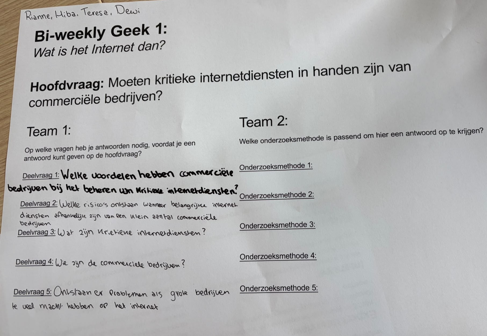

# Model

Het staat model voor digitale tuintjes welke bij 'Het web is voor iedereen' door studenten worden gemaakt.

## Learning Log

### 14 sept - Workshop

-zet hier foto van groepje opdracht

Opdracht 16: Tips lay-out in Duo's (Dewi)
Meer Afbeeldingen toevoegen, alles staat al goed centreert. werken aan de lay-out

Opdracht 17: Responsive voorbeelden (Rianne)

### 7 sept - Workshop 1

-- wat ik heb gedaan:...
--Check out met Hiba:

1. Leg uit wat een digital garden is en waarom dat anders is dan een reguliere website:
2. Leg uit wat een website 'webby' maakt en welke websites jou het meeste inspireren:
3. Vertel waar jij mee aan de slag wilt gaan bij het maken van jouw eigen digital garden (let op: dit zijn jouw eerste ideeën, dit kan en mag veranderen in de loop van het programma:

[...]

[...]

### 2 sept - [HTML & CSS]

[...]

### 31 aug - Kickoff

Een fork van de model repository gemaakt en gepubliceerd via mijn eigen Github omgeving. Ook heb ik een domein naam gekoppeld aan een websiteadress, via alle stappen van DLO. Als laatste heb ik met de klasgenoot Ana uit klas 206 een Check out gedaan:

1. Leg uit wat een source hosting platform is en voor welke jij gekozen hebt: Github, waar je je eigen platform/website kan hosten.
2. Vertel welke domeinnaam jij gekozen hebt en hoe je die hebt gekoppeld aan jouw pagina: Ik heb teresaarchive.nl en Ana balkanbaddie.nl, via de stappen van DLO hebben we een IP adress kunnen koppelen.
3. Beschrijf hoe je aanpassingen aan jouw pagina kunt maken en hoe je er voor zorgt dat die op het web gepubliceerd worden: Je kan via Vscodium mijn tekst aanpassen en zou nog meer willen in de loop van Spint 0.

![beschrijven]
