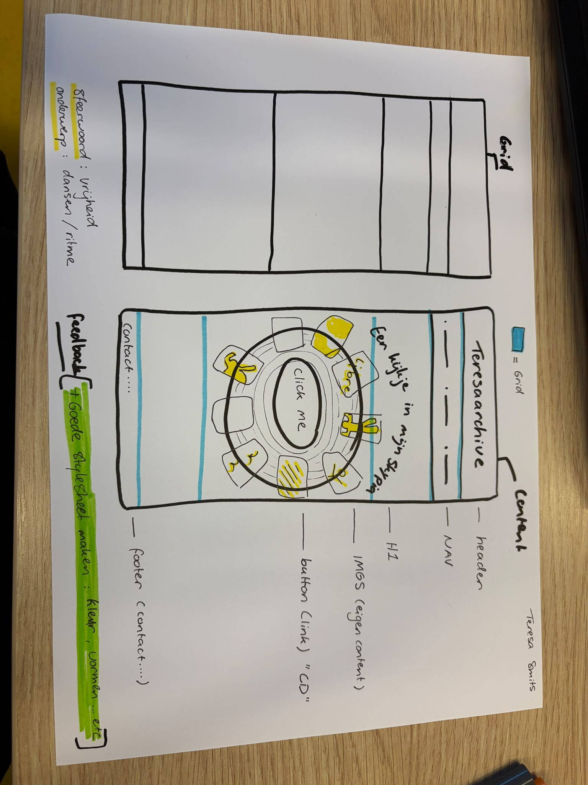
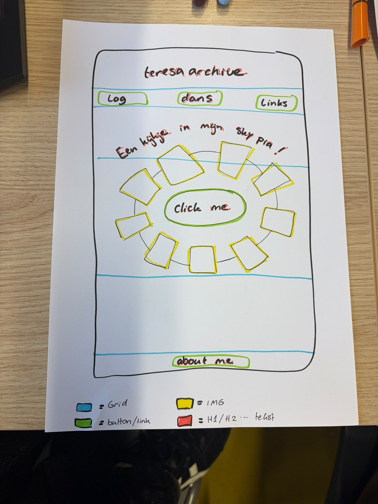
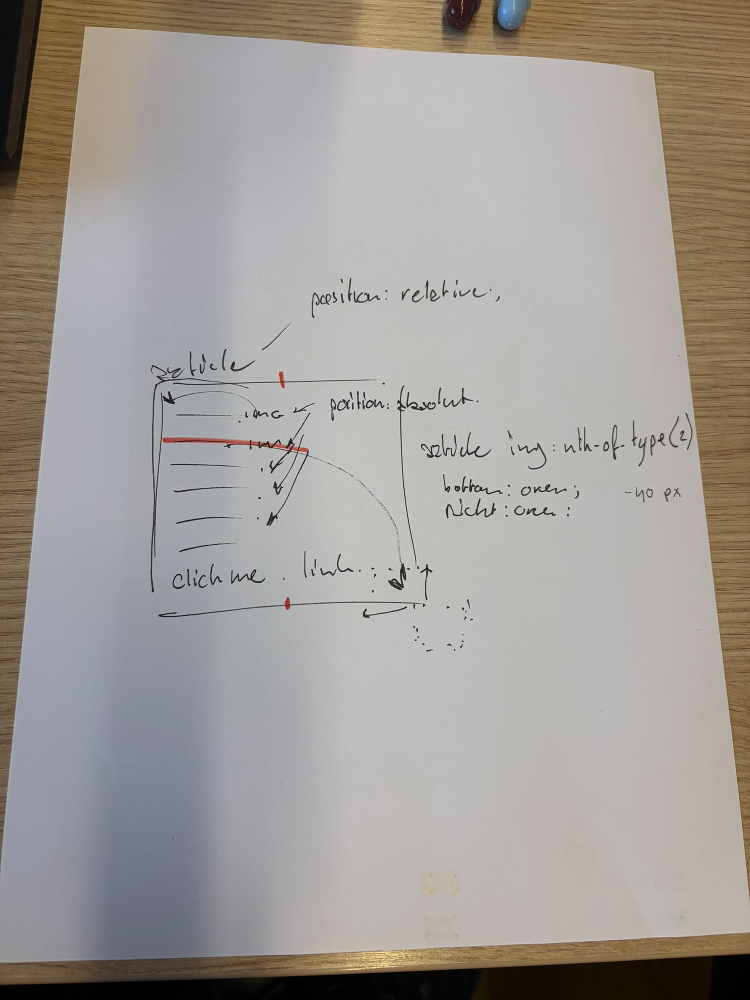
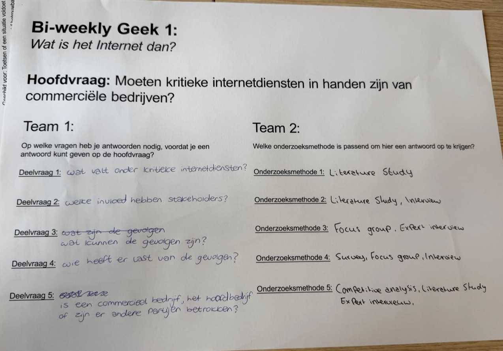

# Learning Log - Teresa

### 18 sept - Retrospective

### 16 sept - Workshop

<strong> schetsen GRID & Idee </strong>

<strong> Check-out met Giel </strong>

1. Noem 3 Gestalt- of Design principes op en laat de ander uitleggen wat ze betekenen en doen: Balans, visuele hierarchie en contrast.
2. Een grid biedt ruimte om te spelen (vrijheid), maar tegelijkertijd ook eenheid en structuur (vastigheid). Wat wordt hiermee bedoeld?: Een soort bak waar je dingen in kna zetten, alleen je kan met ddie dingen oom mee 'spelen, zoals de elementen levendig maken en aanpassen.
3. Welk principe neem je mee in een laatste iteratie van je eigen Garden?: Contast goed gebruiken en witruimte goed in delen.

### 14 sept - Workshop

- Bi-weekly groepsopdracht
  
  

<strong> Opdracht 16: Tips lay-out in Duo's (Dewi)</strong>
Meer Afbeeldingen toevoegen, alles staat al goed centreert. Werken aan de lay-out

<strong> Opdracht 17: Responsive voorbeelden (Rianne) </strong>

1. Als je het kleiner maakt wordt de header aan de linker kant een menu gemaakt
2. UI design word minimaal gemaakt. Minder tekst meer knoppen om het clickable te maken.
3. Alles word kleiner, maar de tekst en afbeeldingen worden juist groter, om het zo duidelijk mogelijk te behouden.

<strong> Check-out met Tim & Rianne </strong>

1. Leg uit wanneer een website 'lelijk' wordt en geef voorbeelden wat je kan doen om deze 'lelijke' onderdelen te fixen?: Waneer er alleen een html pagina hebt zonder css, met display grid en eigen content

2. Vertel welke volgende stap je neemt om je website responsive te maken: Dat mijn header in klapt naar een menutje

3. Kun je het ontwerp en de bouw van je eigen Garden (zo uit je hoofd) onderbouwen in Webby vocabulair?: Ja, als ik de 6 onderwerpen erbij haal wel!

### 7 sept - Workshop 1

-- wat ik heb gedaan:...
--Check out met Hiba:

1. Leg uit wat een digital garden is en waarom dat anders is dan een reguliere website:
2. Leg uit wat een website 'webby' maakt en welke websites jou het meeste inspireren:
3. Vertel waar jij mee aan de slag wilt gaan bij het maken van jouw eigen digital garden (let op: dit zijn jouw eerste ideeën, dit kan en mag veranderen in de loop van het programma:

[...]

[...]

### 2 sept - [HTML & CSS]

[...]

### 31 aug - Kickoff

Een fork van de model repository gemaakt en gepubliceerd via mijn eigen Github omgeving. Ook heb ik een domein naam gekoppeld aan een websiteadress, via alle stappen van DLO. Als laatste heb ik met de klasgenoot Ana uit klas 206 een Check out gedaan:

1. Leg uit wat een source hosting platform is en voor welke jij gekozen hebt: Github, waar je je eigen platform/website kan hosten.
2. Vertel welke domeinnaam jij gekozen hebt en hoe je die hebt gekoppeld aan jouw pagina: Ik heb teresaarchive.nl en Ana balkanbaddie.nl, via de stappen van DLO hebben we een IP adress kunnen koppelen.
3. Beschrijf hoe je aanpassingen aan jouw pagina kunt maken en hoe je er voor zorgt dat die op het web gepubliceerd worden: Je kan via Vscodium mijn tekst aanpassen en zou nog meer willen in de loop van Spint 0.

![beschrijven]
