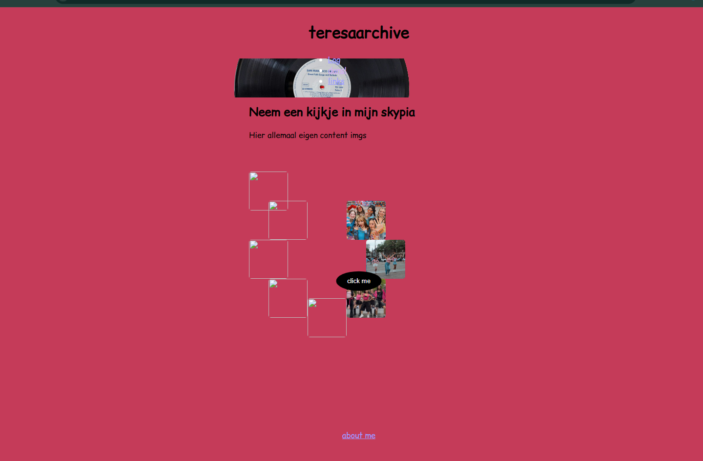
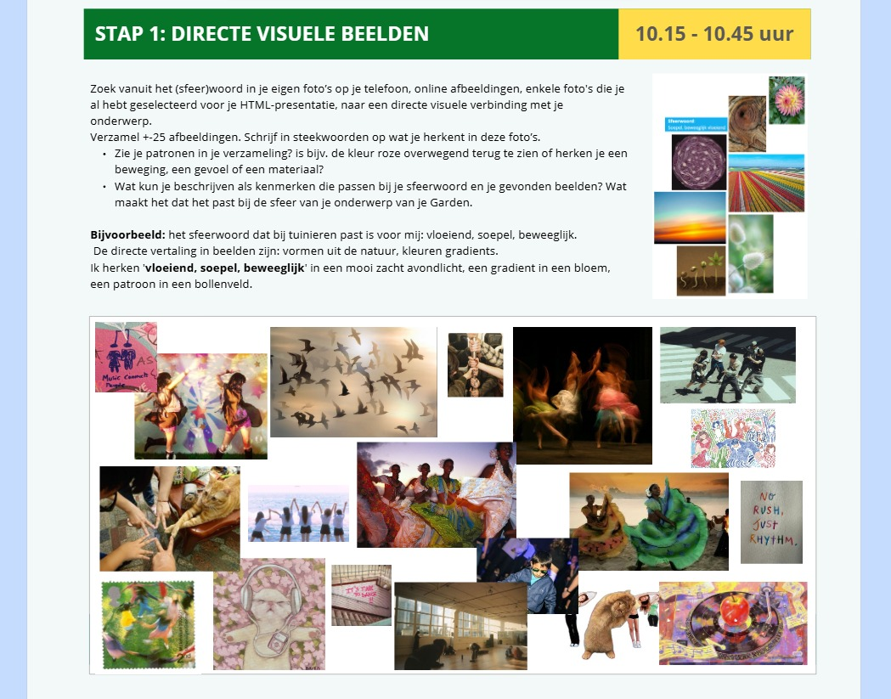
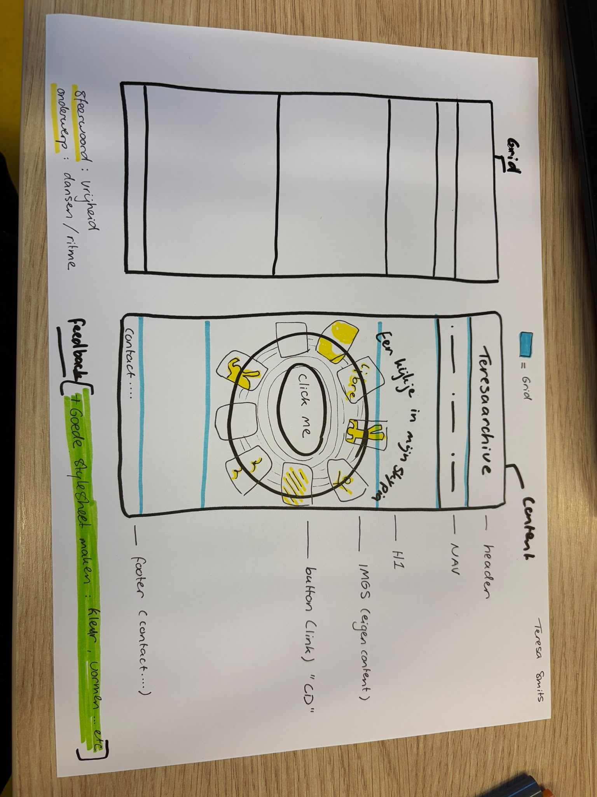
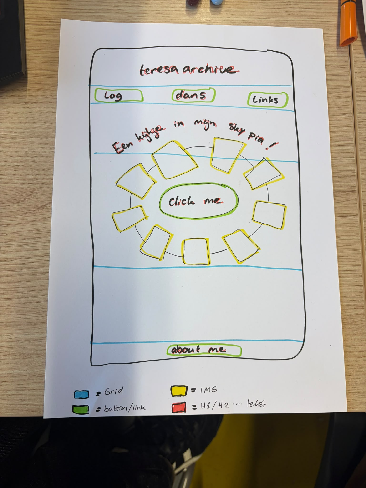
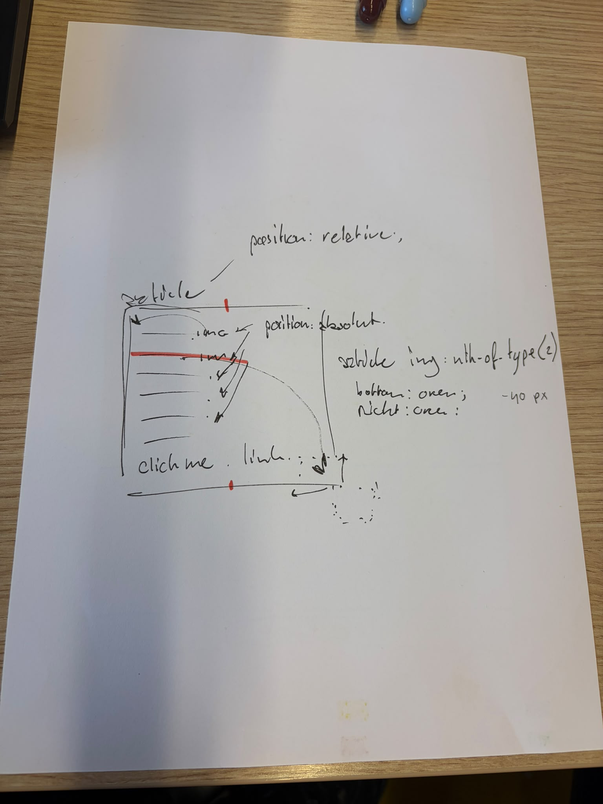
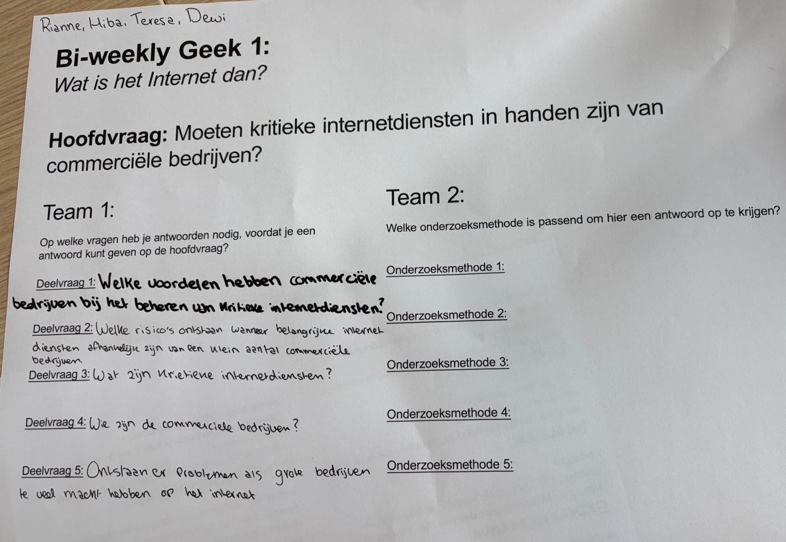
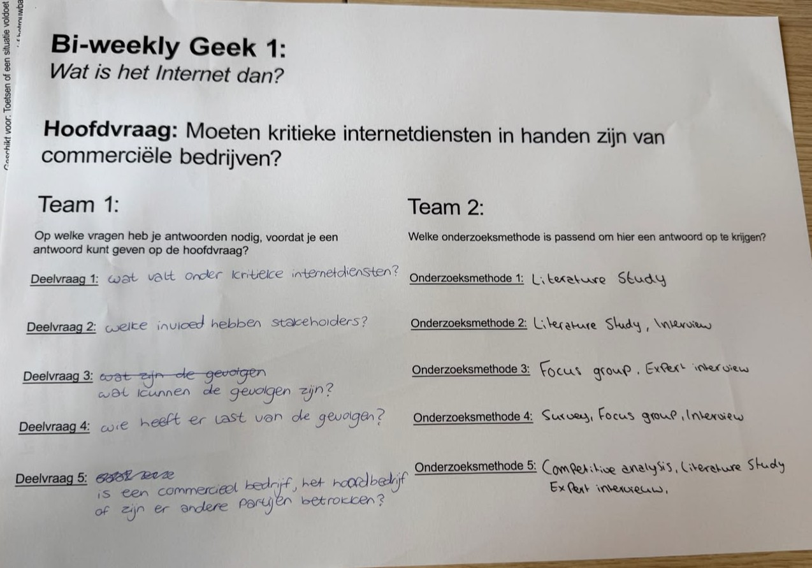

# Learning Log - Teres
Volgorde en goede uitleg tekst is nog in werking....

## 30 sep - Toegankelijkheid en WCAG

Check out met Dewi

1. A11y accessibility en WCAG Web content Accessibility Guidelines
2. Screen reader, ik moet hier nog meer oefenen
3. Contrast (kleur), goede contrast kleuren aanpassen

Ik ben verder gegaan met het toegankelijk maken van mijn website. Ik heb mijn website gecontroleerd aan de hand van de WCAG-checklist. Hierbij heb ik gekeken naar onder andere content, globale HTML-code, keyboard navigation, mobile en touch, headings, lists, images en controls.

Ik heb verschillende verbeteringen aangebracht. Zo heb ik een skip-link toegevoegd, focus-states voor interactieve elementen toegevoegd en ervoor gezorgd dat de website met alleen het toetsenbord te bedienen is.

Ook heb ik `prefers-reduced-motion` toegevoegd. Hierdoor wordt de animatie van de foto's uitgeschakeld voor gebruikers die minder beweging willen.

Daarnaast heb ik gekeken naar de alt-teksten van mijn afbeeldingen en naar de structuur van headings, links en buttons.

## - Responsive website

Ik ben verder gegaan met het realiseren van mijn website. Ik heb ervoor gezorgd dat de website responsive werkt op verschillende schermformaten.

Ik heb onder andere de afbeeldingen aangepast zodat ze op desktop en mobiel op een goede plek staan. Ook heb ik de navigatie aangepast voor kleinere schermen.

## 1 okt - Light en dark mode

Ik heb een light en dark mode toegevoegd aan mijn website. De gebruiker kan met de knop rechtsboven tussen de twee thema's wisselen.

Ik heb hiervoor CSS custom properties gebruikt en JavaScript gebruikt om het thema te veranderen.

## - Foto's rondom de CD

Ik heb de foto's rondom de CD geplaatst. Hiervoor heb ik de afbeeldingen met CSS op verschillende posities rondom het midden geplaatst.

Ik heb de posities steeds aangepast totdat de afbeeldingen goed rondom de CD stonden.

##  - Boogtekst

Ik heb de tekst "Neem een kijkje in mijn skypia" als een boog rondom de CD geplaatst.

Voor de SVG-boog heb ik uitleg van ChatGPT gebruikt om te begrijpen hoe de path-code werkt. 
Daarna heb ik de code aangepast voor mijn eigen ontwerp.

##  - proces

# Oefeningen

## Light & Dark

## Grid

## Gradients

## Button

## 18 sept - Retrospective

Ik was vastgelopen omdat ik een te lastig idee had. Tijdens de retrospective kreeg ik feedback om de opdracht kleiner te houden.

Ik ben daarom verder gegaan met een versimpelde en responsive versie van mijn website. Ook ben ik gaan werken aan een light/dark mode.

**Charley en Kate**

## Visual research

### 16 sept - Workshop

<strong> schetsen GRID & Idee </strong>

<strong> Check-out met Giel </strong>

1. Noem 3 Gestalt- of Design principes op en laat de ander uitleggen wat ze betekenen en doen: Balans, visuele hierarchie en contrast.
2. Een grid biedt ruimte om te spelen (vrijheid), maar tegelijkertijd ook eenheid en structuur (vastigheid). Wat wordt hiermee bedoeld?: Een soort bak waar je dingen in kna zetten, alleen je kan met ddie dingen oom mee 'spelen, zoals de elementen levendig maken en aanpassen.
3. Welk principe neem je mee in een laatste iteratie van je eigen Garden?: Contast goed gebruiken en witruimte goed in delen.

### 14 sept - Workshop

- Bi-weekly groepsopdracht
  
  

<strong> Opdracht 16: Tips lay-out in Duo's (Dewi)</strong>
Meer Afbeeldingen toevoegen, alles staat al goed centreert. Werken aan de lay-out

<strong> Opdracht 17: Responsive voorbeelden (Rianne) </strong>

1. Als je het kleiner maakt wordt de header aan de linker kant een menu gemaakt
2. UI design word minimaal gemaakt. Minder tekst meer knoppen om het clickable te maken.
3. Alles word kleiner, maar de tekst en afbeeldingen worden juist groter, om het zo duidelijk mogelijk te behouden.

<strong> Check-out met Tim & Rianne </strong>

1. Leg uit wanneer een website 'lelijk' wordt en geef voorbeelden wat je kan doen om deze 'lelijke' onderdelen te fixen?: Waneer er alleen een html pagina hebt zonder css, met display grid en eigen content

2. Vertel welke volgende stap je neemt om je website responsive te maken: Dat mijn header in klapt naar een menutje

3. Kun je het ontwerp en de bouw van je eigen Garden (zo uit je hoofd) onderbouwen in Webby vocabulair?: Ja, als ik de 6 onderwerpen erbij haal wel!

### 7 sept - Workshop 1

-- wat ik heb gedaan:...
--Check out met Hiba:

1. Leg uit wat een digital garden is en waarom dat anders is dan een reguliere website:
2. Leg uit wat een website 'webby' maakt en welke websites jou het meeste inspireren:
3. Vertel waar jij mee aan de slag wilt gaan bij het maken van jouw eigen digital garden (let op: dit zijn jouw eerste ideeën, dit kan en mag veranderen in de loop van het programma:

[...]

[...]

### 2 sept - [HTML & CSS]

[...]

### 31 aug - Kickoff

Een fork van de model repository gemaakt en gepubliceerd via mijn eigen Github omgeving. Ook heb ik een domein naam gekoppeld aan een websiteadress, via alle stappen van DLO. Als laatste heb ik met de klasgenoot Ana uit klas 206 een Check out gedaan:

1. Leg uit wat een source hosting platform is en voor welke jij gekozen hebt: Github, waar je je eigen platform/website kan hosten.
2. Vertel welke domeinnaam jij gekozen hebt en hoe je die hebt gekoppeld aan jouw pagina: Ik heb teresaarchive.nl en Ana balkanbaddie.nl, via de stappen van DLO hebben we een IP adress kunnen koppelen.
3. Beschrijf hoe je aanpassingen aan jouw pagina kunt maken en hoe je er voor zorgt dat die op het web gepubliceerd worden: Je kan via Vscodium mijn tekst aanpassen en zou nog meer willen in de loop van Spint 0.

![beschrijven]
